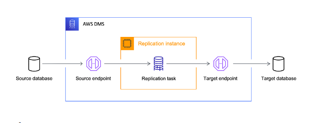
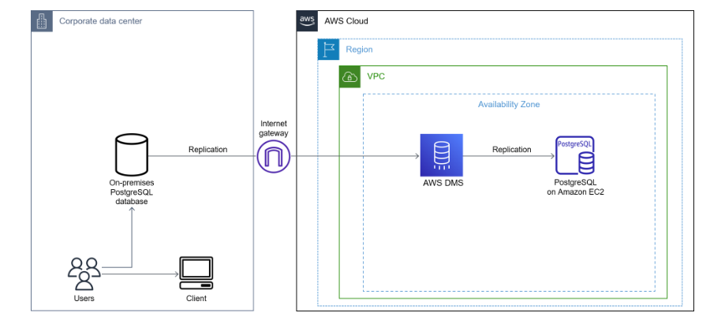

# Data Migration Task
---

As an AWS Data Engineer I have been tasked with Migrating an on-premise Postgres 12 database with 20TB of data to AWS. 

Here's an evaluation of options and recommendations:

## AWS Database Migration Service (DMS):
- **Pros:**
  - Supports homogeneous (*PostgreSQL to PostgreSQL*) and heterogeneous (*other databases to PostgreSQL*) migrations.
  - Fully managed service.
  - Continuous data replication (*minimizing downtime & capture ongoing changes*).
  - Suitable for any database size.
  - On-demand payment (*only pay for what is used*).
  - Supports Schema Conversion Tool (SCT) to covert engine types between source DB & target DB.
- **Cons:**
  - Limited to supported databases/database versions (*< Postgresql 10 not supported*).
- **Recommendation:**
  - This PostgreSQL migration method utilizes a publisher and subscriber model, suitable for databases of any size with low downtime requirements and established schema compatibility. AWS DMS requires a replication instance whose cost varies based on instance class, size, and duration of usage. Data transfer fees apply for moving data to and from AWS DMS, charged based on data volume and region. Additional costs may arise for using extra resources like Kinesis Data Streams for CDC. Storage costs apply post-migration, varying based on database type and data volume in the target AWS database. DMS also charges for migration task creation and execution, with pricing based on task hours consumed, instance class, and region.

## DB Snapshot and restore (pg_dump and pg_restore) + Comprinno (AWS Specialization Partner):
- **Pros:**
  - Straightforward method (*quick & easy*) by leveraging database snapshots.
- **Cons:**
  - Involves significant downtime during the snapshot and restore process.
  - Requires careful planning to ensure consistency during the snapshot.
  - Not suitable for database sizes >100GB.
- **Recommendation:**
  - This method uses pg_dump and pg_restore for data migration, but the downtime may be intolerable for a database of this size. AWS charges for resource use during snapshot creation, such as EC2 or RDS instance costs, and data transmission charges may apply depending on the distance between the on-premise database and AWS. Additional storage charges for snapshots in Amazon S3 or EBS vary according on snapshot size and storage class.

## Snowball:
- **Pros:**
  - High Capacity (*able to move TB & PB data sizes*).
  - Supports fast online transfers (*10 Gigabit Ethernet and USB 3.0 support rapid data transfer rates*) and offline transfers.
  - On-demand payment or Upfront cost (*1 & 3 years commitment*).
- **Cons:**
  - Requires physical shipment of device, adds time to migration (*2-3 weeks arrival period & 1 week end-end transfer*).
- **Recommendation:**
  - This method is suitable for limited bandwidth scenarios or when migrating large volumes of data quickly. Costs include rental fees for the device (*charged per day*) and data transfer between the Snowball device and AWS services like S3 (*charged based on data amount*). Additional charges may apply for shipping the device. Due to the 20TB data size, longer transfer durations will incur higher rental fees and additional costs.

---

My final recommendation: Given the size of your database, data size, schema, and the necessity to minimize downtime, AWS DMS is the best option. AWS DMS provides convenience, ease of use, smooth database transition, and overall cost-effectiveness when compared to other transfer options, such as Snowball or Snowmobile.

If the on-premise database contains features not supported by native AWS choices, manual migration becomes advantageous for full control and customization. This involves running an EC2 instance, configuring it, and importing data. However, this adds complexity and downtime. To ensure resilience using AWS EC2, deploy instances across multiple availability zones, implement backups, configure secondary storage (e.g., S3, EBS), follow AWS security best practices, and conduct regular patches/updates on EC2 instances for compliance.

## Proof-of-concept (POC) plan for DMS solution:
This plan is for testing the AWS Database Migration Service (DMS) solution which involves defining objectives, selecting a suitable environment, setting up the migration, executing tests, and evaluating the results.

1. Objectives:
   - AWS DMS to migrate on-premise PostgreSQL databases (version 10 and above) to AWS with minimal downtime and zero data loss.
   - Leverage AWS DMS's pay-as-you-go model for scalability, making it easy to manage migration resources based on workload.
2. Environment Setup:
   - Set up source (on-premise Postgres 12) and target (RDS Postgres 12) databases, along with replication server and endpoints.
   - Configure migration tasks for full load (20TB data) without schema changes, and establish security measures for DMS access to AWS resources.
3. Migration Plan:
   - Execute full load migration strategy for 20TB data without altering the schema.
4. Data Migration Execution:
   - Initiate DMS migration task, monitor progress, and ensure data consistency and integrity between source and target databases.
   - Validate ongoing data replication (if using CDC) through source database modifications.
5. Performance Testing:
   - Evaluate DMS performance in terms of speed, throughput, and latency, considering scalability under different loads.
   - Assess impact on source database performance during migration.
6. Security & Compliance:
   - Validate DMS security measures (*data encryption in-transit & at rest*) and ensure compliance with regulations for data privacy.
7. Error Handling & Recovery:
   - Implement error handling mechanisms and document troubleshooting procedures for migration errors or failures.
8. Post-Migration Validation:
   - Conduct post-migration validation tests to confirm successful data transfer and assess performance on the target AWS database.
9. Documentation & Reporting:
    - Document any limitations or areas for improvement during the POC, and provide a detailed report summarizing findings and recommendations.
10. Review & Decision:
    - Evaluate whether DMS meets migration requirements and consider alternative solutions if necessary.

# Step-By-Step Implementation Plan 
---

## Product Backlog Items/User Stories
1. **Database Administrator** - Provisions AWS account and resources required for the migration project (*VPC, subnets, security groups, NACLs*), and set IAM roles & permisssions for DMS access to other AWS resources.
2. **Database Engineer** - Analyzes the source PostgreSQL 12 database schema and data to identify any unsupported features or custom configurations that may require conversion.
3. **Migration Specialist** - Sets up AWS DMS replication instance and endpoints (*source: PostgreSQL 12 database & target: RDS PostgreSQL 12 database*), and configures replication tasks for initial data load and ongoing replication.
4. **Security Specialist** - Securely connects on-premise database to AWS using Internet Gateway or Direct Connect (*DX for a more private/dedicated connection*), configure security groups, NACLs, and enable data encryption in transit and at rest.
5. **Database Administrator** - Initiates the migration task for initial data load, monitors progress and replication latency via AWS Management Console or CLI, and validates data integrity between source and target databases.
6. **Performance Tester** - Conducts performance tests for data transfer speed and latency, and validates security and compliance with performance requirements.
7. **Database Engineer** - Optimize database performance on AWS by tuning parameters, indexing, and implementing best practices for database optimization.
8.  **Backup Administrator** - Implements backup and recovery procedures for the AWS database by leveraging AWS Backup, and tests backup & restore processes to ensure data recoverability.
9.  **Documention Specialist** - Documents the migration process, configurations, and best practices for knowledge sharing and future reference.

## Sprints
- Sprint 1 (2 weeks):
  - Setup AWS environment,
  - Analyze source database schema and data.
- Sprint 2 (2 weeks):
  - Configure AWS DMS replication instance and endpoints,
  - Establish network connectivity and security settings,
  - Initiate initial data load migration task.
- Sprint 3 (2 weeks):
  - Monitor data transfer progress and replication latency,
  - Conduct performance tests and validate data integrity,
  - Optimize database performance on AWS.
- Sprint 4 (2 weeks):
  - Implement backup and recovery procedures,
  - Review & Document migration process and configurations.

